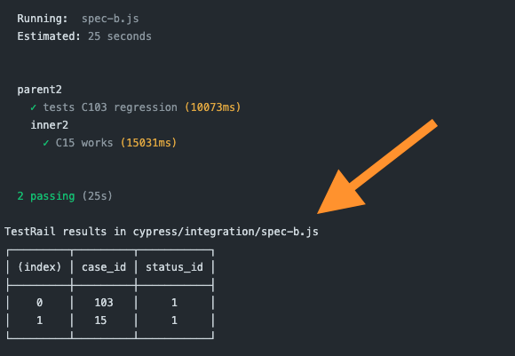

# cypress-testrail-simple

[](https://dashboard.cypress.io/projects/41cgid/runs) [](https://github.com/bahmutov/cypress-testrail-simple/actions/workflows/ci.yml) [](https://circleci.com/gh/bahmutov/cypress-testrail-simple/tree/main)  [![renovate-app badge][renovate-badge]][renovate-app]

> Simple upload of Cypress test results to TestRail

Read the blog post [Cypress And TestRail](https://glebbahmutov.com/blog/cypress-and-testrail/). For testing, [this is a private TestRail project](https://bahmutov.testrail.io/index.php?/suites/view/1).

## Install

Add this plugin as a dev dependency

```
# If using NPM
$ npm i -D cypress-testrail-simple
# If using Yarn
$ yarn add -D cypress-testrail-simple
```

Add the plugin to your Cypress plugin file

```js
// cypress/plugins/index.js
module.exports = async (on, config) => {
  // https://github.com/bahmutov/cypress-testrail-simple
  await require('cypress-testrail-simple/src/plugin')(on, config)
}
```

## Environment variables

When running the Cypress tests on CI, you need to provide the TestRail server variables through the [process (OS) environment variables](https://en.wikipedia.org/wiki/Environment_variable). The following variables should be set:

```
TESTRAIL_HOST=
TESTRAIL_USERNAME=
; the user password or API key for the user
; API key is preferred
TESTRAIL_PASSWORD=
; Note: the project ID is not very sensitive value
TESTRAIL_PROJECTID=
; if you use suites, add a suite ID (with S or without)
TESTRAIL_SUITEID=...
```

If these variables are present, we assume the user wants to use the plugin. You can disable the plugin by passing an argument

```js
module.exports = async (on, config) => {
  // skip loading the plugin
  await require('cypress-testrail-simple/src/plugin')(on, config, true)
}
```

## Bin commands

### testrail-start-run

To start a new TestRail run

```
runId=$(npx testrail-start-run)
```

You can pass an optional test run name and description

```
runId=$(npx testrail-start-run "test run" "test run description")
```

You can redirect the run ID into a file

```
npx testrail-start-run > runId.txt
```

#### Arguments

- `--name` optional name for the test run, alias `-n`
- `--description` optional description for the test run, alias `-d`
- `--suite` optional suite ID, alias `-s`
- `--spec` optional [globby](https://github.com/sindresorhus/globby#readme) pattern for finding specs, extracting case IDs (using the `C\d+` regular expression), and starting a new TestRail run with those case IDs only. Alias `-s`. This option is very useful if only some test cases are automated using Cypress. See the workflow examples in [.github/workflows/cases.yml](./.github/workflows/cases.yml) and [.circleci/config.yml](./.circleci/config.yml).
- `--dry` only parses the arguments and finds the test case IDs, but does not trigger the run

```
npx testrail-start-run --name "test run" --description "test run description"
# prints the run id
```

For readability, you can split the command across multiple lines usually

```
npx testrail-start-run \
  --name "test run" \
  --description "test run description" \
  --spec "cypress/integration/featureA/**.js"
```

#### --find-specs

You can let this utility find the Cypress specs (via [find-cypress-specs](https://github.com/bahmutov/find-cypress-specs)) and extract the test case IDs. Instead of `--spec` parameter, use `--find-specs` flag.

```
npx testrail-start-run \
  --name "test run" \
  --description "test run description" \
  --find-specs
```

#### --tagged

Sometimes you want to pick the tests with a tag to create a new test run. You can use the combination of `--find-specs` and `--tagged tag` to pick only the test case IDs for tests with effective tag "tag"

```
npx testrail-start-run \
  --find-specs --tagged @user
```

You can list several tags, if a test has any one of them, it will be picked.

```js
// example spec file
describe('parent', { tags: '@user' }, () => {
  describe('parent', { tags: '@auth' }, () => {
    it('C50 works a', { tags: '@one' }, () => {})
    it('C51 works b', () => {})
  })
})
describe('outside', { tags: '@new' }, () => {
  it('C101 works c', () => {})
})
```

For example, `--find-specs --tagged @new` will only pick the test "works c" to run with its id `101`. If you want to run the authentication tests, you can call `--find-specs --tagged @auth` and it will pick the case IDs `50` and `51`.

### testrail-run-results

Shows the TestRail run results

```
npx testrail-run-results --run 60
```

Prints a table with test cases

### testrail-close-run

To close an open test run, pass the run ID as an argument or in the file `./runId.txt`

```
# read the run ID from the command line argument
npx testrail-close-run 60
# read the run ID from the file runId.txt
npx testrail-close-run
```

This script allows two explicit parameters:

- `--run <run ID>` to pass the run ID to close
- `--force` to skip checking if the test run has all the tests completed

### testrail-check-case-ids

Prints the list of case IDs for the given TestRail project and optionally verifies them against the IDs found in the Cypress spec files

```text
# just print the list of TestRail cases and titles
$ npx testrail-check-case-ids
# compare the case IDs in the Cypress specs
# against the TestRail project
$ npx testrail-check-case-ids --find-specs
```

When comparing the cases in the spec files against the TestRail project, if there are extra case IDs found in the spec files, the script exits with code 1.

## Testing locally

### Run with all case IDs found from the specs

1. create a new test run

```
as-a . node ./bin/testrail-start-run \
  --name "local test run" \
  --description "test run description" \
  --find-specs
```

Prints the new test run ID, for example `635`

2. Run the tests

```
as-a . npx cypress run --env testRailRunId=635
```

3. Close the TestRail run

```
as-a . node ./bin/testrail-close-run 635
```

### Run with tagged tests

1. create a new test run for tests tagged "@regression"

```
as-a . node ./bin/testrail-start-run \
  --name "local test run for tag @regression" \
  --description "test run description" \
  --find-specs --tagged @regression
```

Prints the new test run ID, for example `662`

2. Run the tests

```
as-a . npx cypress run --env testRailRunId=662
```

3. Close the TestRail run

```
as-a . node ./bin/testrail-close-run 662
```

## Sending test results

During `cypress run` the plugin can send test results for each test case found in the test title using `C\d+` regular expression. To send the results, you need to pass the TestRail run ID. There are several was of doing this:

- pass the run ID as an environment variable `TESTRAIL_RUN_ID`

```
$ TESTRAIL_RUN_ID=635 npx cypress run
```

- pass it via Cypress env value `testRailRunId`

```
$ npx cypress run --env testRailRunId=635
```

- read it from the text file `runId.txt` (written there by the `testrail-start-run` script)

## Examples

- [bahmutov/test-rail-example](https://github.com/bahmutov/test-rail-example)
- [bahmutov/test-rail-suite-example](https://github.com/bahmutov/test-rail-suite-example)

## Debugging

This tool uses [debug](https://github.com/visionmedia/debug#readme) to output verbose logs. To see the logs, run it with environment variable `DEBUG=cypress-testrail-simple`.

To start a new test rail run locally and see how the new run is created

```
$ as-a . node ./bin/testrail-start-run.js --spec 'cypress/integration/\*.js'
```

Make sure this plugin is registered correctly in your `cypress/plugins/index.js` file and the plugin function is declared with the `async` keyword in v3. During the test run, you should see messages like this after each spec



## Why?

Because [cypress-testrail-reporter](https://github.com/Vivify-Ideas/cypress-testrail-reporter) is broken in a variety of ways and does not let me open issues to report the problems.

## Migration

### v1 to v2

The config plugin registration function used to take 2 parameters (it is unclear from the tests)

```js
// v1
// cypress/plugins/index.js
module.exports = (on, config) => {
  // https://github.com/bahmutov/cypress-testrail-simple
  require('cypress-testrail-simple/src/plugin')(on)
}
```

In the second version, we need to pass both the `on` and the `config` parameters

```js
// v2
// cypress/plugins/index.js
module.exports = (on, config) => {
  // https://github.com/bahmutov/cypress-testrail-simple
  require('cypress-testrail-simple/src/plugin')(on, config)
}
```

If you want to skip the plugin's registration step, pass the 3rd argument

```js
// v2
// cypress/plugins/index.js
module.exports = (on, config) => {
  const skipPluginRegistration = true
  // https://github.com/bahmutov/cypress-testrail-simple
  require('cypress-testrail-simple/src/plugin')(
    on,
    config,
    skipPluginRegistration,
  )
}
```

### v2 to v3

The plugin registration function has changed from synchronous to `async`. This means _your Cypress plugin file_ also needs to be marked `async` and await the registration.

```js
// v2
// cypress/plugins/index.js
module.exports = (on, config) => {
  // https://github.com/bahmutov/cypress-testrail-simple
  require('cypress-testrail-simple/src/plugin')(on, config)
}
```

Now

```js
// v3
// cypress/plugins/index.js
module.exports = async (on, config) => {
  // https://github.com/bahmutov/cypress-testrail-simple
  await require('cypress-testrail-simple/src/plugin')(on, config)
}
```

## Small print

Author: Gleb Bahmutov &lt;gleb.bahmutov@gmail.com&gt; &copy; 2021

- [@bahmutov](https://twitter.com/bahmutov)
- [glebbahmutov.com](https://glebbahmutov.com)
- [blog](https://glebbahmutov.com/blog)
- [videos](https://www.youtube.com/glebbahmutov)
- [presentations](https://slides.com/bahmutov)
- [cypress.tips](https://cypress.tips)

License: MIT - do anything with the code, but don't blame me if it does not work.

Support: if you find any problems with this module, email / tweet /
[open issue](https://github.com/bahmutov/cypress-testrail-simple/issues) on Github

## MIT License

Copyright (c) 2021 Gleb Bahmutov &lt;gleb.bahmutov@gmail.com&gt;

Permission is hereby granted, free of charge, to any person
obtaining a copy of this software and associated documentation
files (the "Software"), to deal in the Software without
restriction, including without limitation the rights to use,
copy, modify, merge, publish, distribute, sublicense, and/or sell
copies of the Software, and to permit persons to whom the
Software is furnished to do so, subject to the following
conditions:

The above copyright notice and this permission notice shall be
included in all copies or substantial portions of the Software.

THE SOFTWARE IS PROVIDED "AS IS", WITHOUT WARRANTY OF ANY KIND,
EXPRESS OR IMPLIED, INCLUDING BUT NOT LIMITED TO THE WARRANTIES
OF MERCHANTABILITY, FITNESS FOR A PARTICULAR PURPOSE AND
NONINFRINGEMENT. IN NO EVENT SHALL THE AUTHORS OR COPYRIGHT
HOLDERS BE LIABLE FOR ANY CLAIM, DAMAGES OR OTHER LIABILITY,
WHETHER IN AN ACTION OF CONTRACT, TORT OR OTHERWISE, ARISING
FROM, OUT OF OR IN CONNECTION WITH THE SOFTWARE OR THE USE OR
OTHER DEALINGS IN THE SOFTWARE.

[renovate-badge]: https://img.shields.io/badge/renovate-app-blue.svg
[renovate-app]: https://renovateapp.com/

```

```
